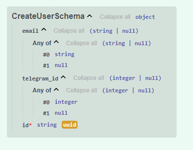
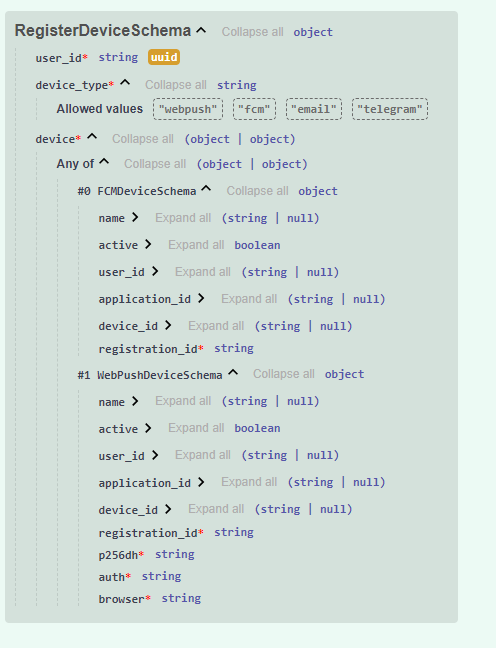
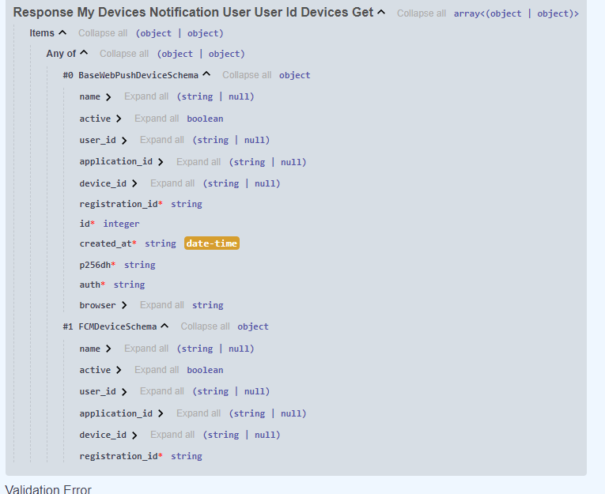

# API

### notification/user/register [post]

Точка для регистрации пользователя

Схема входных данных



### notification/device/register [post]

Зарегистрировать пользователя если его нет, и зарегистрировать устройство
Пример данных
```json
{
  "user_id": "3fa85f64-5717-4562-b3fc-2c963f66afa6",
  "device_type": "webpush",
  "device": {
    "name": "string",
    "active": true,
    "user_id": "3fa85f64-5717-4562-b3fc-2c963f66afa6",
    "application_id": "string",
    "device_id": "string",
    "registration_id": "string"
  }
}
```
Схема входных данных



### notification/user/{user_id}/devices [get]

Получить список устройств пользователя

Схема выходных данных




### /notification/user/ [get, patch]

Получить или обновить пользователя

### notification/user/{user_id}/send_message [post]

Отправить сообщение на все устройства пользователя

```json
{
  "message": "string"
}

```

### notification/user/{user_id}/send_message_by_type [post]

Отправить сообщение на все устройства пользователя по типу

```json
{
  "message": "string",
  "type_device": "webpush" //"webpush","fcm","email","telegram"
}

```

# Отправка сообщения в очередь

На текущий момент есть поддержка отправки сообщений из очереди на все устройства пользователя

**Пример сообщения:**

```json
{
  "message": "Hello Efirit!",
  "user_id": "3fa85f64-5717-4562-b3fc-2c963f66afa6"
}

```

Для подключения к RabbitMQ используйте следующие данные

```shell
${RABBIT_HOST_NAME}
${RABBIT_HOST_PORT}
${RABBIT_USER_NAME}
${RABBIT_PASSWORD}
${NOTIFICATION_QUEUE_NAME} # Название очереди для подключения
```